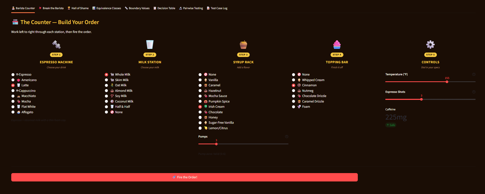
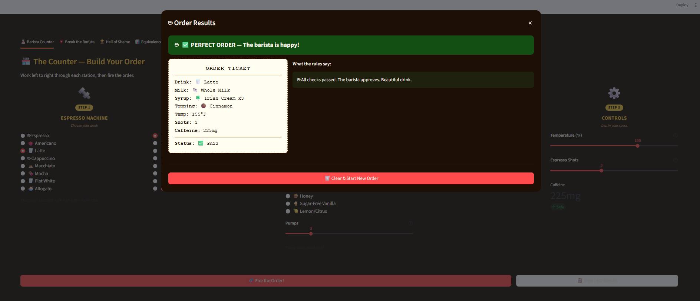
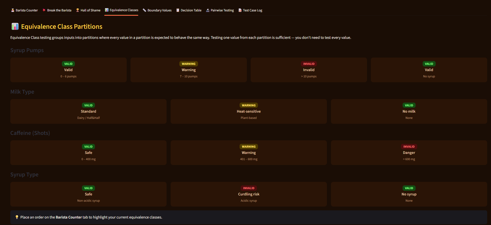
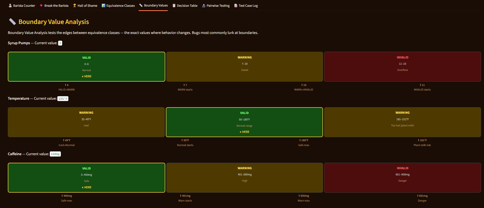
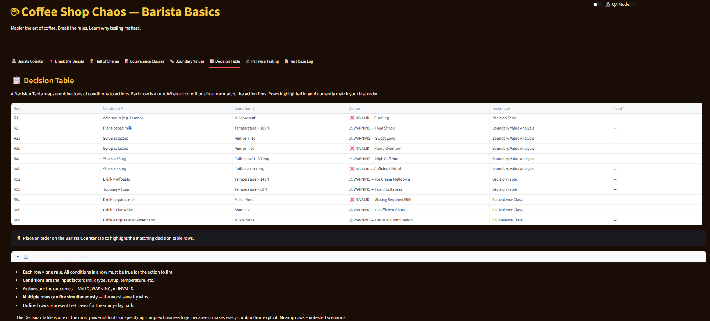
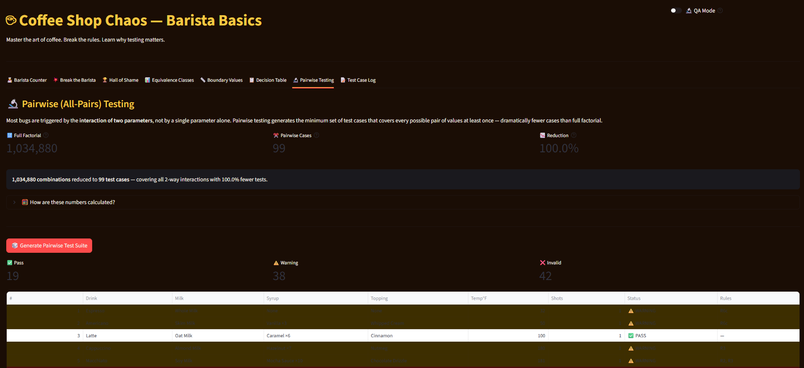

# Vibe Coding Assignment — Coffee Shop Chaos: Barista Basics

## Introduction: Test Case Methodologies

This assignment covers four software testing techniques simultaneously, using a coffee shop ordering simulator as the domain. Each technique is described below, along with guidance on when to use it and its limitations.

---

### Equivalence Class Testing

Equivalence class testing divides input data into partitions where every value in a partition is expected to behave the same way. Rather than testing every possible input, you pick one representative from each class. If the representative passes, the rest of the class is assumed to pass as well.

**When to use it:**
- Any time an input has a large or infinite range of possible values
- When inputs can be grouped into logical categories (valid types, invalid types, edge categories)
- Early in testing when time is limited and broad coverage is needed

**Example from the app:**
- Milk Type: `{Whole Milk, Skim Milk, Half & Half}` = Standard class, `{Oat, Almond, Soy, Coconut}` = Plant-based class, `{None}` = No-milk class
- Syrup Pumps: `{0–6}` = Valid class, `{7–10}` = Warning class, `{>10}` = Invalid class

**Limitations:**
- Does not catch errors at the exact edge of a boundary — that requires Boundary Value Analysis
- Assumes all values within a partition behave identically, which may not hold for complex logic
- Partition definitions require domain knowledge; wrong partitions produce false confidence

---

### Boundary Value Analysis

Boundary Value Analysis (BVA) focuses specifically on the values at the edges between equivalence classes. Experience shows that bugs are disproportionately likely to occur exactly at boundaries — off-by-one errors, `>` vs `>=` mistakes, and similar issues.

**When to use it:**
- Any input with a numeric range or ordered values
- After identifying equivalence classes, to harden the boundary transitions
- When validating business rules that use thresholds (maximum quantities, temperature limits, dosage caps)

**Example from the app:**
- Syrup pumps: test at 6 (last valid), 7 (first warning), 10 (last warning), 11 (first invalid)
- Temperature: test at 180°F (last safe for plant milk), 181°F (first heat shock warning)
- Caffeine: test at 400mg (last safe), 401mg (first warning), 600mg (last warning), 601mg (first invalid)

**Limitations:**
- Only addresses single-parameter boundaries in isolation; multi-parameter interactions require Decision Tables or Pairwise
- Does not address non-numeric inputs (categories, types, flags)
- Requires accurate knowledge of where boundaries are defined — wrong boundaries mean wrong tests

---

### Decision Table Testing

A Decision Table captures combinations of conditions and the actions that result from them. Each column is a rule: a unique combination of condition values with a corresponding outcome. Decision table testing ensures every rule in the table is covered.

**When to use it:**
- Business logic with multiple interacting conditions
- When the same inputs can produce different results depending on their combination
- When you need to document and communicate complex branching logic to stakeholders

**Example from the app:**
| Condition | Rule 1 | Rule 2 | Rule 3 |
|---|---|---|---|
| Acid syrup selected | YES | NO | YES |
| Milk present | YES | YES | NO |
| **Result** | ❌ INVALID (curdling) | ✅ VALID | ⚠️ RISK |

**Limitations:**
- Tables grow exponentially with the number of conditions — 10 boolean conditions = 1,024 rules
- Impractical for large condition sets without first reducing using equivalence classes
- Assumes conditions are independent; complex dependencies between conditions require careful design

---

### Pairwise (All-Pairs) Testing

Pairwise testing is based on the empirical observation that most software defects are caused by the interaction of two parameters, not more. Rather than testing every possible combination of all parameters, pairwise testing generates the minimum set of test cases where every pair of parameter values appears together at least once.

**When to use it:**
- Systems with many configurable parameters (settings screens, configuration files, multi-field forms)
- After equivalence class partitioning has reduced the value space for each parameter
- When full factorial testing is impractical but random testing is insufficiently systematic

**Example from the app:**
- 7 parameters (drink, milk, syrup, topping, pumps, temperature, shots) with EC representative values yield **1,034,880** full-factorial combinations
- Pairwise reduces this to **89 test cases** — covering all 2-way interactions at a 99.99% reduction
- This is the standard trade-off: pairwise misses some 3-way and higher-order interactions, but those are statistically rare failure modes

**Limitations:**
- Only guarantees 2-way coverage; 3-way interactions may still slip through (though this is less common in practice)
- Cannot replace domain-specific tests for known high-risk combinations
- Requires tooling (e.g., `allpairspy`) or careful manual construction — manually building a covering array is error-prone

---

## Vibe Coding Assignment: Coffee Shop Chaos — Barista Basics

### Concept

The goal was to create a single application that makes all four testing techniques tangible and interactive, rather than explaining them abstractly. A coffee shop order builder was chosen as the domain because:

1. It has a rich set of parameters (drink, milk, syrup, toppings, temperature, shots)
2. The business rules map naturally to all four techniques
3. The consequences of bad combinations are viscerally understandable (curdling milk, espresso + ice cream disasters)

The app was built using **Streamlit** (Python), which allowed rapid prototyping of an interactive UI with sliders, radio buttons, and real-time feedback without any frontend framework overhead.

### Architecture

The app is structured as four decoupled Python modules:

```
VibeCode1/
├── app.py        # Streamlit UI — 8 tabs, counter layout, game modes
├── menu.py       # Static data — drinks, ingredients, recipes, Hall of Shame
├── rules.py      # Rule engine — 11 rules, each tagged with TestType enum
├── pairwise.py   # Pairwise generator — allpairspy wrapper + greedy fallback
└── requirements.txt
```

The key architectural decision was the `RuleResult` dataclass in `rules.py`. Every rule violation carries a `TestType` label (`EQUIVALENCE_CLASS`, `BOUNDARY_VALUE`, `DECISION_TABLE`, or `PAIRWISE`) alongside the rule ID, severity, and human-readable description. This is what makes the app educational rather than just functional — every failure tells the user *which testing technique* would catch it.

```python
@dataclass(frozen=True)
class RuleResult:
    rule_id:     str        # e.g. "R1", "R3"
    title:       str        # short headline shown in UI
    description: str        # full explanation
    test_type:   TestType   # which technique caught this
    severity:    Severity   # PASS / WARNING / INVALID
    parameter:   str        # which input(s) are involved
    detail:      str        # specific numeric/value context
```

### Rule Examples

**Decision Table rule — Acid + Milk Curdling:**

```python
def check_acid_milk_curdling(order: Order) -> Optional[RuleResult]:
    if order.syrup in ACID_SYRUPS and order.milk_type != "None":
        return RuleResult(
            rule_id="R1",
            title="Acid + Milk = Curdling",
            test_type=TestType.DECISION_TABLE,
            severity=Severity.INVALID,
            ...
        )
```

**Boundary Value rule — Syrup pump zones:**

```python
def check_syrup_pump_boundary(order: Order) -> Optional[RuleResult]:
    if order.syrup_pumps > 10:
        return RuleResult(rule_id="R3", test_type=TestType.BOUNDARY_VALUE,
                          severity=Severity.INVALID, ...)
    if order.syrup_pumps > 6:
        return RuleResult(rule_id="R3", test_type=TestType.BOUNDARY_VALUE,
                          severity=Severity.WARNING, ...)
```

**Equivalence Class rule — Missing required ingredient:**

```python
if recipe.get("requires_milk") and order.milk_type == "None":
    return RuleResult(rule_id="R6a", test_type=TestType.EQUIVALENCE_CLASS,
                      severity=Severity.INVALID, ...)
```

### App Features and Tabs

The UI is organized as a coffee shop counter with five stations (Espresso Machine → Milk Station → Syrup Rack → Topping Bar → Controls), followed by a "Fire the Order!" button that opens a modal results dialog.

| Tab | What it demonstrates |
|---|---|
| **Barista Counter** | Build and evaluate any order; results dialog explains which rules fired and why |
| **Break the Barista** | Game mode — random orders are generated and the user predicts PASS/WARNING/INVALID before the answer is revealed |
| **Hall of Shame** | 7 pre-built "legendary disasters," each illustrating a different rule type |
| **Equivalence Classes** | Visual partition grid for each parameter, with the current order's class highlighted |
| **Boundary Values** | Color-zone gauges for syrup pumps, temperature, and caffeine |
| **Decision Table** | Full rule table with matched rows highlighted in gold |
| **Pairwise Testing** | Coverage comparison (1,034,880 → 89), full generated test suite, CSV export |
| **Test Case Log** | Running log of all orders placed across all tabs, exportable to CSV |

A **QA Mode** toggle reveals rule IDs, `TestType` labels, and EC class names throughout the UI — intended as a "student mode" for deeper analysis.

---

### Screenshots

**Barista Counter — Order Builder**



**Barista Counter — Order Results Dialog**



**Equivalence Class Partitions Tab**



**Boundary Value Analysis Tab**



**Decision Table Tab**



**Pairwise Testing Tab**



---

### Sunny Day Scenarios

These are valid orders — all rules pass.

| Order | Why it passes |
|---|---|
| Latte + Whole Milk + Vanilla ×3 + Foam + 155°F + 2 shots | All within valid EC ranges; no acid/milk conflict; caffeine 150mg |
| Cappuccino + Skim Milk + None + Cinnamon + 158°F + 2 shots | Canonical recipe satisfied; no boundary violations |
| Espresso + None + None + None + 185°F + 1 shot | Single shot (75mg); espresso requires no milk; no conflicts |
| Flat White + Whole Milk + None + None + 160°F + 2 shots | Meets the 2-shot minimum for Flat White; within heat range |

---

### Rainy Day Scenarios

These are invalid or warning orders — one or more rules fire.

| Order | Rule Fired | Technique |
|---|---|---|
| Latte + Whole Milk + Lemon/Citrus ×4 + 165°F | R1 — Acid + Milk = Curdling | Decision Table |
| Latte + Oat Milk + None + 210°F | R2 — Plant Milk Heat Shock (>180°F) | Boundary Value |
| Latte + Oat Milk + Pumpkin Spice ×15 | R3 — Syrup Overflow (>10 pumps) | Boundary Value |
| Espresso + None + None + 185°F + 6 shots | R4 — Caffeine Critical (450mg) | Boundary Value |
| Affogato + None + None + 185°F | R5a — Ice Cream Meltdown (>140°F) | Decision Table |
| Cappuccino + Whole Milk + Vanilla + Foam + 35°F | R5b — Foam Collapse (<50°F) | Decision Table |
| Latte + **None** + Vanilla + 160°F | R6a — Missing Required Milk | Equivalence Class |
| Flat White + Whole Milk + None + 160°F + **1 shot** | R6b — Insufficient shots (<2) | Equivalence Class |

---

### Demo Video

[▶ Watch App Demo — Break the Barista Game Mode](https://regis365-my.sharepoint.com/:v:/g/personal/edick_regis_edu/IQBySalczQAZSq5fohN3_HcYARFp7PwMOxWSaBgfr4FVel8?e=9danYm)

---

## Conclusions

### Problems Encountered

**Context window management** was the biggest challenge. The initial prompt describing all the ingredients, rule sets, and desired features was long enough to exceed what Claude could process in a single turn. I had to break the specification into multiple passes — first submitting the core concept and structure, then the full ingredient inventory and rule definitions. This required the AI to re-establish context between turns, which occasionally introduced drift in naming conventions between modules.

**Python 3.9 f-string limitations** caused a syntax error on first run. Claude generated f-strings containing backslash-escaped quotes inside the expression braces, which was valid in Python 3.12 but not in Python 3.9. The fix was straightforward (pre-compute the conditional string as a variable before the f-string), but it required an extra debug cycle that the AI didn't catch before writing the file.

**CSS specificity conflicts with Streamlit's internal styles** required multiple iterations to get the text legibility right on the dark background. Streamlit applies its own default styles aggressively, and targeting the right `data-testid` selectors took trial and error. Several rounds of adjustment were needed to make radio labels, captions, and tab-level paragraph text consistently white.

**Widget state reset in Streamlit** required a non-obvious workaround. Streamlit doesn't allow resetting widget values directly — the solution was to suffix widget keys with a version counter that increments on clear, forcing Streamlit to create new widget instances with default values.

### What I Learned About AI Coding Tools

Using Claude Code for this project reinforced several patterns about working effectively with agentic AI:

**Specificity of the prompt matters enormously.** The richer and more structured the initial specification — ingredient lists, rule descriptions, UI layout, data models — the less back-and-forth was required. Vague prompts like "make the UI look like a coffee shop" produced a reasonable but generic result; specifying "a horizontal counter with five stations, each as a column with a station icon header, step badge, and radio buttons for selections" produced the intended layout on the first attempt.

**AI tools are most effective as a co-author, not a one-shot generator.** The most productive pattern was: describe the architecture, review the generated plan, refine specific decisions, then let it generate the implementation. Trying to generate everything in one shot created files too long to verify in context.

**The AI's knowledge of library internals is very strong but not infallible.** Claude's knowledge of Streamlit APIs (dialogs, session state, widget keys, CSS selectors) was generally accurate and saved significant documentation lookup time. The Python version compatibility issue was the one case where it produced code that worked in a newer runtime than the target.

**Agentic tools are genuinely faster for boilerplate-heavy work.** The four-module architecture — `menu.py`, `rules.py`, `pairwise.py`, `app.py` — would have taken several hours to write and wire up by hand. The AI generated all four files, correctly cross-referenced between them, and handled edge cases (pairwise fallback when `allpairspy` is unavailable, versioned widget keys for reset) that I would not have anticipated on a first pass.

Overall this was the most direct experience I have had with the limitations of context windows as a real engineering constraint, not just an abstract API parameter.
