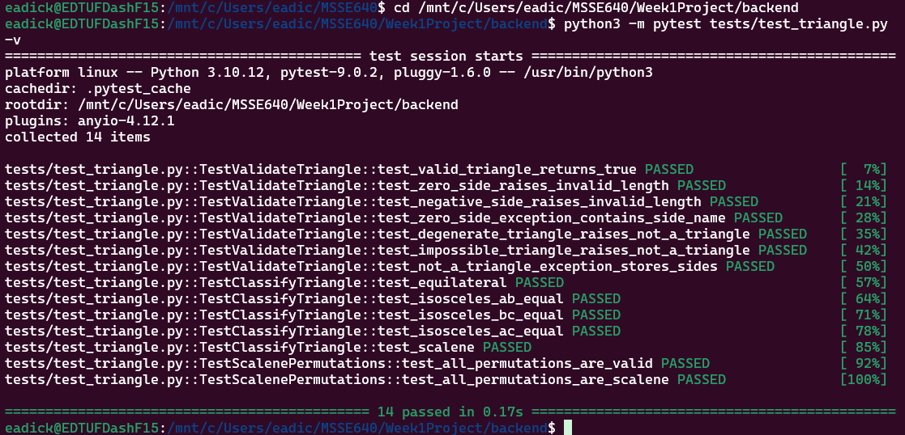

# Triangle Project Overview

## Introduction

Triangle Analyzer is a full stack web application that I wrote with the assitance of Claude Code. It accepts three side lengths as inputs and classifies the triangle type created by linking the sides at the endpoint (equilateral, isosceles, or scalene). Invalid inputs are handled by custom exceptions. The UI animates the three sides as steel beams spinning into the center of the screen and either creating a triangle or bouncing apart and melting in the lava below. A legend as well as text indicate the outcome associated with each combination. 

## Details Of The Program

To build this program, I worked with Claude Code in an Ubuntu terminal and reviewed and edited the code in Microsoft Visual Studio Code. After setting [Claude Code Up](https://claude.ai/public/artifacts/03a4aa0c-67b2-427f-838e-63770900bf1d) and creating a folder for it to work in, I explained that I wanted to plan and build an application and the pertinent details of my application from the assignment. I chose a python backend and react UI for the application, and asked for suggestions aside from flask as the interface layer. It recommended FAST API. It asked me a numbe of additional questions, such as whether or not I wanted to create custom exception classes for error handling (I did). I also asked that we write unit tests as well as integration tests. We discussed that the UI should be responsive and mobile friendly. I let Claude know that I would like to provide additional creative detail regarding the UI later. 

## Table With Example Test Data

The inputs into the tests are sidelengths in integer format, tied to expected outcomes. A summary of the inputs, test, and expected results are listed below:

| Side A | Side B | Side C | Test(s)           | Expected Result                                                    |
|--------|--------|--------|---------------------|------------------------------------------------------------------|
| 3      | 4      | 5      | validate_triangle   | is True                                                          |
| 0      | 4      | 5      | validate_triangle   | raises InvalidSideLengthError                                    |
| -1     | 4      | 5      | validate_triangle   | raises InvalidSideLengthError                                    |
| 3      | 0      | 5      | validate_triangle   | raises InvalidSideLengthError                                    |
| 1      | 2      | 3      | validate_triangle   | raised NotATriangleError                                         |
| 1      | 1      | 10     | validate_triangle   | raised NotATriangleError                                         |
| 1      | 2      | 3      | validate_triangle   | raised NotATriangleError                                         |
| 5      | 5      | 5      |TestClassifyTriangle | == "equalateral"                                                 |
| 3      | 5      | 5      |TestClassifyTriangle | == "isosceles"                                                   |
| 5      | 3      | 5      |TestClassifyTriangle | == "isosceles"                                                   |
| 5      | 5      | 3      |TestClassifyTriangle | == "isosceles"                                                   |              
| 3      | 4      | 5      |TestClassifyTriangle | == "scalene"                                                     |
| 3      | 4      | 5      | tests validate_triangle & classify_triangle in all permutations | "True" and "scalene" |

  ## Unit Tests

  The backend unit tests can be found in "test_triangle.py". They take side lengths in float format as inputs. They test that classes and functions in the code have the expected output given specific sidelength inputs. The first 7 test validation functions. There are also 5 tests to ensure that the function "classify_triangle" produces the correct value output. The last two test that given all permutations of the set of sides 3, 4 and 5, the expected scalene output is generated.
  
I can't claim to have chosen these tests, as Claude wrote them based on the information I provided. But you can see that they comprehensively cover the backend logic of the application. 

## Bugs

There were no unit test bugs, but the integration tests (not discussed above) caught one issue when run: 

- One test failed: NonNumericInputError wasn't caught by Pydantic because it inherited from Exception not ValueError — fixed by making it inherit from both TriangleError and ValueError (a teaching moment about Python's exception hierarchy and how frameworks depend on it)
  - All 29 tests passed

## Problems
I sheepishly admitted on the call, after the work involved in the setup, the backend was completely written and tested within 15 minutes. I did ask a number of questions to better understand Claude's chosen paths and reviewed the code to ensure I understood it in VS Code.

## Screenshots

Below is the output from running test_triangle.py with pytest:

  

