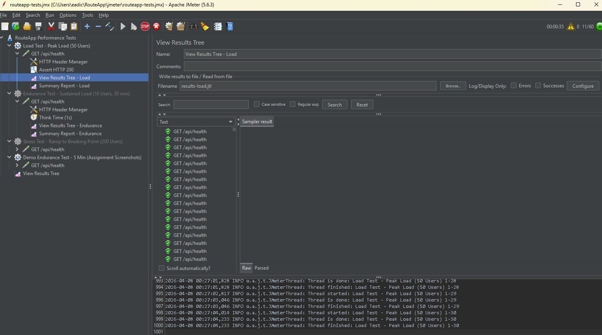
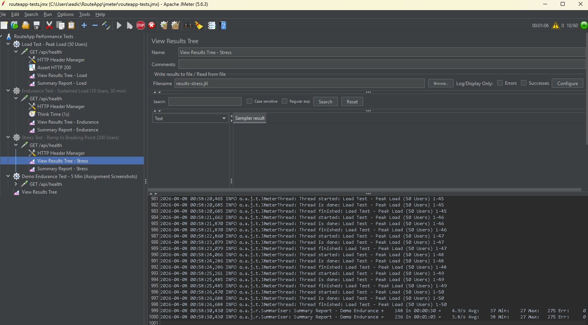
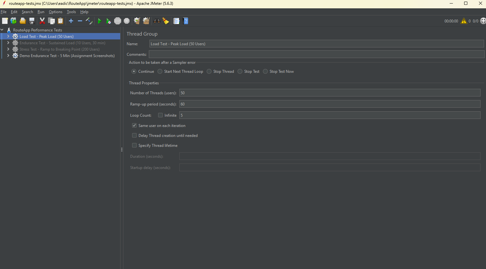
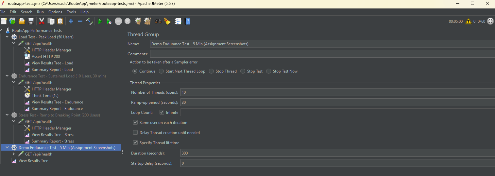
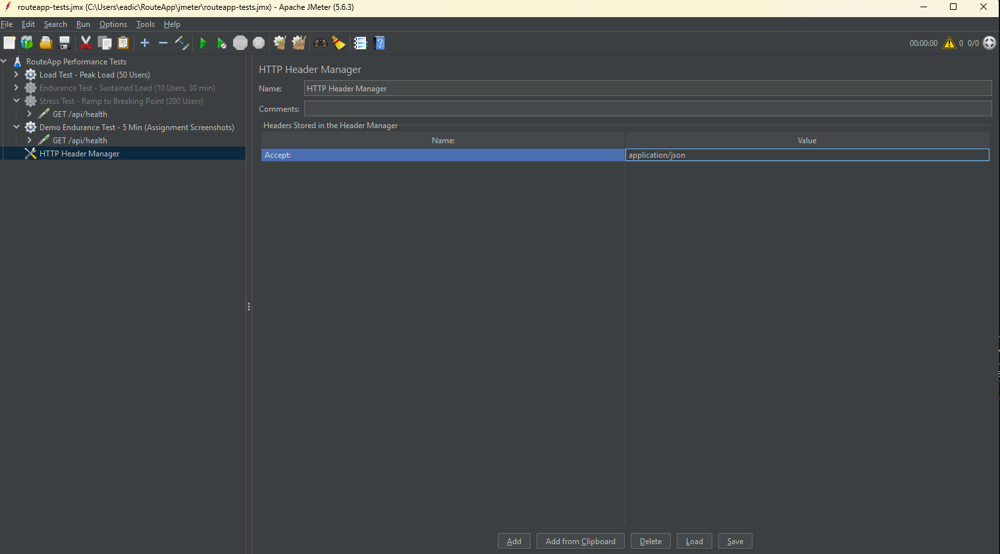
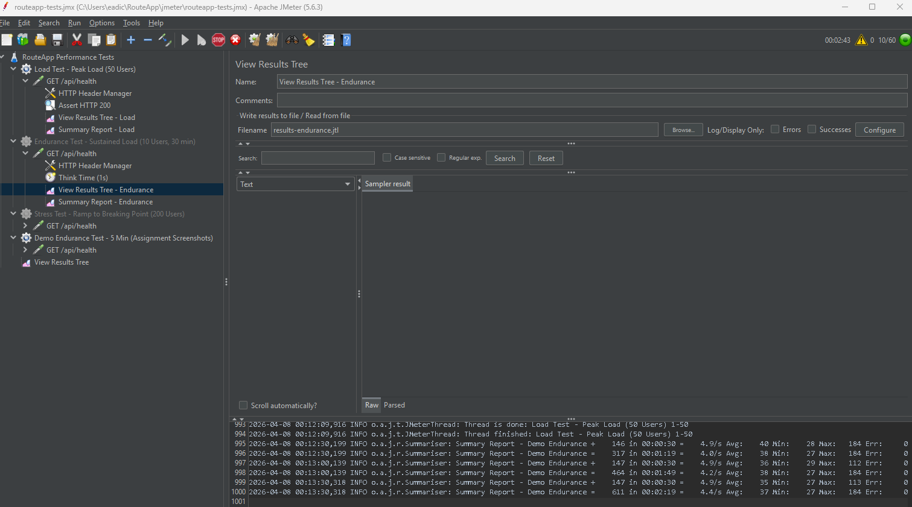
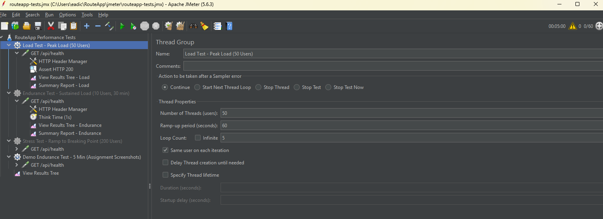
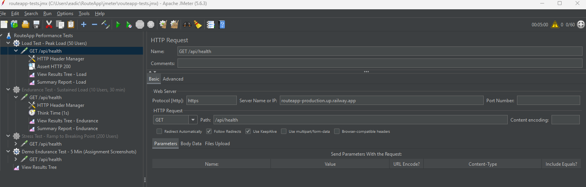
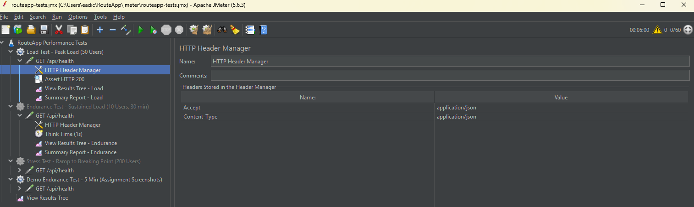

# Project 2: Performance Testing with JMeter

**Course:** MSSE 640  
**Student:** Evan D  
**Date:** April 2026  
**GitHub Repository (RouteApp):** [dtoes62/RouteApp](https://github.com/dtoes62/RouteApp) *(Private — Professor Grainer has been granted read access)*

---

## Introduction

This project explores performance testing concepts and applies them to a real-world full-stack web application called **RouteApp** — a route optimization and planning tool built for home healthcare nurses to optimize patient visit routes from their calendars. RouteApp is built with Next.js 14, PostgreSQL (Neon), and integrates with the Google Maps and Google Calendar APIs.

The application is deployed at: **https://route-app-one.vercel.app**
  - A gmail account is required to try the app. Please send me a note to    whitelist you as a tester if desired

A key challenge encountered during this project was designing a testing environment that produces *meaningful* performance results. RouteApp is hosted on **Vercel**, a serverless platform that imposes a 10-second function timeout and introduces cold start latency. Running JMeter directly against a serverless host would produce results that reflect platform constraints rather than application behavior. To address this, a split deployment architecture was adopted:

- **Production:** Vercel (Next.js-native, global CDN, free Hobby plan)
- **Test/Performance environment:** Railway (persistent server, no cold starts, no timeouts)
- **Database:** Neon (serverless PostgreSQL, free tier)
- **CI/CD:** GitHub Actions — 4-stage pipeline: Lint & Build → Railway health check → JMeter performance gate → Vercel production deploy

This architecture ensures that every push to `main` is automatically performance-validated against the Railway test environment before reaching production users. The JMeter test plan (`jmeter/routeapp-tests.jmx`) is committed to the repository and executed as part of every CI run.

A real-world complication encountered during this project was a Railway platform incident (elevated build times, April 6 2026) that caused health check timeouts in the CI pipeline — a practical demonstration of why external platform reliability is a factor in deployment planning and why monitoring status pages is part of operational awareness.

---

## Part 1: Research

### 1.1 Types of Performance Tests

Performance testing evaluates how a system behaves under various load conditions. Three primary test types are described below, each with a thread profile graph plotting **Number of Threads** (Y axis) over **Time** (X axis).

---

#### Load Testing

Load testing validates that an application meets performance requirements at the expected peak number of concurrent users. Threads ramp up to a target level, hold steady, then ramp down. The goal is to confirm acceptable response times and error rates under normal and peak conditions — not to break the system.

**Characteristics:**
- Simulates realistic expected user volume
- Identifies bottlenecks at anticipated peak load
- Validates SLAs (response time thresholds, error rate budgets)

**RouteApp CI configuration:** 50 threads, 60-second ramp, 5 request loops per thread

```
Threads
  50 |          ████████████████████████
     |        ██                        ██
     |      ██                            ██
     |    ██                                ██
   0 |████__________________________________████▶ Time
       Ramp Up   Sustained Peak             Ramp Down
       (60s)     (5 loops × 50 users)
```



---

#### Endurance Testing

Endurance testing (also called soak testing) runs a moderate but sustained load over an extended period. The goal is to detect issues that only emerge over time: memory leaks, database connection pool exhaustion, disk space accumulation from logging, or gradual response time degradation.

**Characteristics:**
- Moderate, constant thread count
- Long duration (30 minutes to several hours)
- Monitors for creeping response time increases or error rate drift

**RouteApp configuration:** 10 threads, 60-second ramp, 30-minute continuous run. A 5-minute demo variant is also included for assignment screenshots.

```
Threads
  10 |        ████████████████████████████████████
     |      ██                                    (continues...)
     |    ██
     |  ██
   0 |██____________________________________________▶ Time
       Ramp    Sustained Moderate Load (30 min / 5 min demo)
       (60s)
```


---

#### Stress / Spike Testing

Stress testing pushes the system beyond its expected capacity to find the breaking point — the thread count at which error rates spike, response times degrade severely, or the system fails outright. Spike testing is a variation where load is suddenly injected rather than ramped, simulating an unexpected traffic surge.

**Characteristics:**
- High thread count with aggressive ramp
- Deliberately seeks failure conditions
- Results inform capacity planning and autoscaling thresholds

**RouteApp configuration:** 200 threads, 300-second ramp, 10 loops per thread (disabled in CI to prevent pipeline timeouts; run manually for analysis)

```
Threads
 200 |                    ██████████████
     |                  ██             ██
     |                ██               ██
     |              ██                  ██
     |            ██                     ██
     |          ██                        ██
     |        ██                           ██
   0 |████████_______________________________████▶ Time
       Ramp Up (aggressive)     Break Point   Recovery
       (300s)
```



---

### 1.2 JMeter Components

Apache JMeter is an open-source Java-based load testing tool. The following components are used in the RouteApp test plan.

---

#### Thread Groups

A **Thread Group** is the entry point of every JMeter test plan. It defines:
- **Number of Threads:** The number of concurrent virtual users
- **Ramp-Up Period:** How long to take to reach the full thread count
- **Loop Count / Duration:** How many iterations or how long to run (a scheduler can enforce a fixed duration)

The RouteApp test plan (`jmeter/routeapp-tests.jmx`) contains four Thread Groups in a single file:

| Thread Group | Threads | Ramp | Duration/Loops | Enabled in CI |
|---|---|---|---|---|
| Load Test | 50 | 60s | 5 loops | Yes |
| Endurance Test (30 min) | 10 | 60s | 1800s | No |
| Stress Test | 200 | 300s | 10 loops | No |
| Demo Endurance (5 min) | 10 | 30s | 300s | Yes |

> **Screenshot placeholder:** Insert JMeter Thread Group panel showing the Demo Endurance Test configuration (10 threads, 30s ramp, 300s duration, scheduler enabled).

---

#### HTTP Request Sampler

The **HTTP Request Sampler** defines the actual HTTP request JMeter sends to the target server. Configuration includes:
- Protocol, host, port, and path
- HTTP method (GET, POST, etc.)
- Request body and query parameters
- Connect timeout and response timeout

All RouteApp samplers target `GET /api/health` — a purpose-built unauthenticated endpoint that performs a live database ping (`SELECT 1`) and returns a JSON status response. This provides a meaningful end-to-end probe without requiring OAuth session tokens, which JMeter cannot obtain through a standard Google/Microsoft OAuth flow.

The `/api/health` endpoint returns:
```json
{"status":"ok","timestamp":"2026-04-07T00:00:00.000Z","version":"0.1.0","db":"ok"}
```
Or `{"status":"degraded","db":"unreachable"}` with HTTP 503 if the database is unreachable.

A 10-second response timeout is configured on each sampler to prevent JMeter threads from hanging indefinitely if the server is overloaded.

> **Screenshot placeholder:** Insert JMeter HTTP Request Sampler panel showing GET /api/health configuration with timeout settings.

---

#### Config Elements

**Config Elements** augment samplers with shared configuration applied to all requests within their scope. The primary config element used is the **HTTP Header Manager**, which injects HTTP headers into every request:

```
Accept: application/json
Content-Type: application/json
```

Other available config elements (not used in this plan but relevant):
- **HTTP Cookie Manager** — maintains session cookies across requests
- **CSV Data Set Config** — parameterizes tests with data from a CSV file
- **HTTP Cache Manager** — simulates browser caching behavior

> **Screenshot placeholder:** Insert HTTP Header Manager panel showing the Accept and Content-Type headers.

---

#### Listeners

**Listeners** collect, display, and store test results in real time. JMeter includes several built-in listeners:

| Listener | Purpose |
|---|---|
| **View Results Tree** | Shows every request/response in detail — useful for debugging |
| **Summary Report** | Aggregated statistics: throughput, avg/min/max response time, error % |
| **Aggregate Report** | Adds percentile columns (90th, 95th, 99th) to Summary |
| **Graph Results** | Real-time response time plot |
| **Summariser** | Console output for headless (non-GUI) CI runs |

Each Thread Group in the RouteApp plan has its own View Results Tree and Summariser. When run via GitHub Actions (`jmeter -n`), the Summariser outputs live statistics to the CI log, and the full HTML report is generated and uploaded as a build artifact.


---

### 1.3 Application Performance Index (Apdex)

**Apdex** (Application Performance Index) is an open industry standard that converts raw response time measurements into a single user satisfaction score between **0.0** and **1.0**. It was developed to provide a consistent, vendor-neutral way to express performance in terms that are meaningful to stakeholders — not just engineers.

#### Formula

```
Apdex(T) = (Satisfied + Tolerating / 2) / Total Samples
```

A threshold **T** (typically 500ms for web applications) defines three response time buckets:

| Category | Response Time | Contribution |
|---|---|---|
| **Satisfied** | ≤ T | 1.0 per request |
| **Tolerating** | T < response ≤ 4T | 0.5 per request |
| **Frustrated** | > 4T or error | 0.0 per request |

#### Score Interpretation

| Score | Rating |
|---|---|
| 1.00 | Excellent |
| 0.94 – 0.99 | Very Good |
| 0.85 – 0.93 | Good |
| 0.70 – 0.84 | Fair |
| < 0.70 | Unacceptable |

#### Application to RouteApp

Different endpoints warrant different Apdex thresholds:

| Endpoint | T (threshold) | Target Apdex | Rationale |
|---|---|---|---|
| `/api/health` | 500ms | ≥ 0.94 | Lightweight DB ping — should be fast |
| `/api/geocode` | 1000ms | ≥ 0.90 | External Google API call |
| `/api/route/optimize` | 3000ms | ≥ 0.85 | Computationally intensive — TSP solver + Directions API |

JMeter generates Apdex scores automatically in its HTML report when run with the `-e -o report` flags, which the GitHub Actions pipeline produces after each CI run and uploads as a build artifact.

---

## Part 2: JMeter Demo

The complete JMeter test plan is located in the RouteApp repository at `jmeter/routeapp-tests.jmx` and can be opened directly in JMeter 5.6.3+. The test plan is parameterized — the target URL is passed at runtime:

```bash
jmeter -n -t jmeter/routeapp-tests.jmx -l results.jtl -e -o report \
  -JBASE_URL=https://your-railway-test-url.up.railway.app
```

---

### 2.1 Endurance Test (Demo — 5 Minutes)

**Step 1 — Open JMeter and load the test plan**

File → Open → select `jmeter/routeapp-tests.jmx`. The Test Plan tree on the left shows all four Thread Groups.



**Step 2 — Thread Group: Demo Endurance Test**

Select the `"Demo Endurance Test - 5 Min (Assignment Screenshots)"` Thread Group. Configuration:
- Number of Threads: **10**
- Ramp-Up Period: **30 seconds**
- Duration: **300 seconds** (5 minutes)
- Scheduler: **enabled**



**Step 3 — HTTP Request Sampler**

Expand the Thread Group and select the HTTP Request Sampler. Configuration:
- Method: **GET**
- Server Name: Railway test environment URL
- Path: **/api/health**
- Connect Timeout: **5000ms**
- Response Timeout: **10000ms**



**Step 4 — HTTP Header Manager**

Select Thread Group → Add → Config Elements → HTTP Header Manager. Headers added:
- `Accept: application/json`


**Step 5 — View Results Tree**

Select Thread Group → Add → Listeners → View Results Tree. Run the test (green play button). Each request shows:
- Green sampler label = HTTP 200 pass
- Red sampler label = failure
- Response body tab shows `{"status":"ok","db":"ok",...}`



---

### 2.2 Load Test (50 Users)

Select the `"Load Test - Peak Load (50 Users)"` Thread Group:
- Number of Threads: **50**
- Ramp-Up Period: **60 seconds**
- Loop Count: **5**

Follow the same steps as above (HTTP Request Sampler, HTTP Header Manager, View Results Tree).






---

## Conclusion and Recommendations

### What I Learned

This project revealed that performance testing is as much about **environment design** as it is about running load generators. The central architectural decision — using Railway (persistent server) for JMeter targets rather than Vercel (serverless) — was essential to producing clean, meaningful measurements. Serverless cold starts and function timeout limits would have introduced platform-level constraints that masquerade as application performance problems.

Integrating JMeter into a **GitHub Actions CI/CD pipeline** transformed performance testing from a one-time exercise into a continuous quality gate. Every commit to `main` was automatically tested against the Railway environment before reaching production on Vercel. A commit that causes response time regressions will fail the JMeter step and never reach users.

The project also demonstrated that real-world deployment involves significant operational complexity beyond writing code: OAuth redirect URI management, database migration coordination across environments, environment variable propagation across three platforms (GitHub, Railway, Vercel), and platform-level incidents (Railway's build time degradation on April 6, 2026) all affected the deployment timeline. This context is valuable for understanding why **DevOps practices** — infrastructure as code, automated testing, and observability — exist.

The **Apdex score** provides a clean, stakeholder-friendly metric that translates raw response time distributions into a single satisfaction index, making performance results accessible to non-technical audiences.

### Recommendations for Improving This Assignment

1. **Address authentication in JMeter.** Most real applications require authentication. The assignment would benefit from a section on handling session cookies, API keys, or token injection in JMeter — this is one of the most common real-world obstacles and is not covered in introductory JMeter documentation.

2. **Require CI integration as a deliverable.** Running JMeter manually teaches the tool, but integrating it into an automated pipeline is the industry standard. Adding this as a required step (not just extra credit) would significantly increase the practical value and career relevance of the assignment.

3. **Discuss platform choice in the rubric.** The choice of test environment (serverless vs. persistent server) has a profound impact on JMeter results. Prompting students to think critically about *where* they run tests — not just *how* — would deepen understanding of performance testing in cloud environments.

---

## Extra Credit: Linux Commands for Performance Evaluation on a VM/Server

When running RouteApp on a Linux server (such as Railway's underlying infrastructure), the following commands complement JMeter results by providing server-side visibility:

| Command | Purpose |
|---|---|
| `top` / `htop` | Real-time CPU and memory usage per process |
| `vmstat 1` | CPU, memory, swap, and I/O statistics sampled every 1 second |
| `iostat -x 1` | Disk I/O utilization — useful for detecting database-bound bottlenecks |
| `netstat -an` / `ss -s` | Active network connections and socket state summary |
| `free -h` | Memory and swap usage in human-readable format |
| `df -h` | Disk space — important during endurance tests (log file accumulation) |
| `ps aux --sort=-%cpu` | Processes sorted by CPU consumption |
| `journalctl -f -u your-service` | Tail service logs in real time during a test run |
| `ab -n 1000 -c 50 http://localhost:3000/api/health` | Apache Bench — quick command-line load test without JMeter GUI |
| `curl -o /dev/null -s -w "%{time_total}\n" http://localhost:3000/api/health` | Single request timing — baseline measurement before load testing |
| `ulimit -n` | Show maximum open file descriptors (connection limit) |
| `dmesg \| tail` | Kernel messages — detects OOM (out of memory) kills under stress |

These commands are particularly valuable during stress testing, where server-side resource exhaustion (CPU saturation, memory pressure, connection limits) is the expected failure mode. Correlating JMeter response time graphs with `vmstat` and `iostat` output allows precise identification of the bottleneck — whether it is CPU, memory, disk I/O, or network.
