# MSSE 640 — Project 4: Selenium Test Automation
**Student:** Evan Dick (edick@regis.edu)  
**Submission date:** May 2026  
**Repository:** [RouteApp](https://github.com/dtoes62/RouteApp) — `selenium_tests/`

---

## Application Under Test

**RouteApp** ([https://route-app-one.vercel.app](https://route-app-one.vercel.app)) is a home-health-nurse route-optimization SaaS. Users sign in with Google or Microsoft, select patient appointments from their calendar, and run an AI-powered optimizer that produces a turn-by-turn schedule. The app integrates Google Calendar, Microsoft Outlook, and Google Maps.

**Tech stack:** Next.js 14 / React 18 / TypeScript, NextAuth, Prisma, Vercel (production), Railway (test), Neon PostgreSQL.

> **Note on scope:** The course assignment targets Google Online Boutique (microservices demo). With instructor approval, this submission automates RouteApp instead. The four tests below cover the same Selenium competencies — end-to-end flows, form interaction, conditional assertions, setup/teardown — and add Google Calendar API integration for programmatic test fixtures.

---

## Setup Instructions

### Prerequisites
| Tool | Version |
|------|---------|
| Python | 3.11+ |
| Google Chrome | Latest stable |
| Google Cloud project with Calendar API enabled | — |

### Install

```bash
cd RouteApp/selenium_tests
pip install -r requirements.txt
```

### Configure

```bash
cp .env.example .env
```

Edit `.env` and fill in three values:

1. **`ROUTEAPP_SESSION_TOKEN`** — sign in to [route-app-one.vercel.app](https://route-app-one.vercel.app) in Chrome, open DevTools → Application → Cookies → copy the value of `__Secure-next-auth.session-token`.

2. **`GOOGLE_CREDENTIALS_FILE`** — download an OAuth 2.0 Desktop App credential JSON from Google Cloud Console and place it in `selenium_tests/` (default name `credentials.json`).

3. **`HOME_ADDRESS`** — leave as `77 Village Dr, Schwenksville, PA 19473` or change to your own start location.

**First run** opens a browser to authorize the Google Calendar API; a `token.json` is cached for subsequent runs.

### Run all tests

```bash
cd RouteApp/selenium_tests
pytest -v --html=report.html
```

---

## User Stories

### Test 1 — Optimization Mode Comparison

> **As a home health nurse** with a full day of patient visits,  
> **I want** the 'Get Home Earliest' optimization mode to return the same or earlier home-arrival time compared to 'Minimize Drive Time' and 'Minimize Distance,'  
> **so that** I can trust the optimizer to honor its label and get me home as soon as possible.

**Acceptance criterion:** `home_arrival(earliest_home) ≤ home_arrival(minimize_time)` AND `home_arrival(earliest_home) ≤ home_arrival(minimize_distance)`.

---

### Test 2 — Profile Persistence After Sign-Out

> **As a home health nurse,**  
> **I want** my home address and vehicle preferences (type, category, axle count) to be saved to my account  
> **so that** I never have to re-enter them after signing out and back in.

**Acceptance criterion:** All four profile fields (address, emission type, vehicle category, axle count) match the saved values after a full sign-out / sign-in cycle.

---

### Test 3 — Stop Management: Add, Toggle, Remove

> **As a home health nurse,**  
> **I want** to add calendar events to my route, toggle stops between Fixed and Flexible scheduling, and remove individual stops  
> **so that** I have complete control over my itinerary before optimizing.

**Acceptance criteria:**
- After adding all 4 events the planner shows a count of 4 stops.
- Clicking the Fixed badge on a stop changes it to Flexible (blue).
- Removing one stop drops the count to 3.
- The toggled stop's Flexible state survives the removal of an unrelated stop.

---

### Test 4 — Fixed Appointment Time Constraint Is Honoured

> **As a home health nurse,**  
> **I want** the optimizer to guarantee that I never arrive late at a Fixed appointment  
> **so that** I can commit to specific patient appointment times with confidence.

**Acceptance criteria:**
- The estimated arrival time for the Fixed stop is at or before its scheduled start (2:00 PM).
- No late-arrival warning (⚠ late) appears beside that stop in the itinerary.

---

## Test Implementations

All four tests live in `RouteApp/selenium_tests/tests/`.

| File | Test function | Lines |
|------|--------------|-------|
| `test_1_optimization_comparison.py` | `test_earliest_home_is_not_later_than_other_modes` | ~80 |
| `test_2_profile_persistence.py` | `test_profile_values_persist_after_sign_out` | ~70 |
| `test_3_stop_management.py` | `test_add_toggle_remove_stops` | ~65 |
| `test_4_fixed_appointment_constraint.py` | `test_fixed_stop_arrival_is_not_late` | ~75 |

### Framework Architecture

```
selenium_tests/
├── conftest.py                  # Session-scoped WebDriver, autouse auth fixture
├── pages/                       # Page Object Model
│   ├── base_page.py             # Shared waits, helpers, time parser
│   ├── dashboard_page.py        # Calendar date nav, event selection
│   ├── planner_page.py          # Start location, modes, optimize, itinerary
│   └── profile_page.py          # Address / vehicle form read/write
└── helpers/
    ├── date_utils.py            # next_upcoming_sunday/saturday utilities
    └── google_calendar_api.py   # Programmatic test-event create/delete
```

**Authentication strategy:** Google OAuth cannot be automated without hitting bot-detection. The tests inject the `__Secure-next-auth.session-token` cookie directly into the browser session before each test. The cookie is read from an `.env` file and is valid for ~30 days. This is the industry-standard approach for testing Next.js apps backed by OAuth providers.

**Test isolation:** Tests 1, 3, and 4 use `scope="module"` fixtures to create Google Calendar events once via the Calendar API and delete them in teardown. Tests 1 and 3 use different days (Sunday vs. Saturday) to prevent cross-test contamination. Test 4 uses the Saturday two weeks ahead for additional isolation.

---

## Test 1 — Code

```python
def test_earliest_home_is_not_later_than_other_modes(browser, calendar_events, test_sunday):
    dashboard = DashboardPage(browser)
    planner = PlannerPage(browser)

    dashboard.navigate_to()
    dashboard.navigate_to_date(test_sunday)
    dashboard.wait_for_events(min_count=7)

    all_titles = dashboard.get_event_titles()
    selected = random.sample(all_titles, 6)
    for title in selected:
        dashboard.add_event_to_route(title)

    dashboard.click_plan_route()
    planner.set_start_location(HOME_ADDRESS)

    home_arrival = {}
    for mode in ("earliest_home", "minimize_time", "minimize_distance"):
        planner.select_optimization_mode(mode)
        if mode == "earliest_home":
            planner.set_departure_time("08:00")
        planner.click_optimize()
        home_arrival[mode] = planner.get_estimated_home_arrival()
        planner.click_reset()

    assert home_arrival["earliest_home"] <= home_arrival["minimize_time"]
    assert home_arrival["earliest_home"] <= home_arrival["minimize_distance"]
```

---

## Test 2 — Code

```python
def test_profile_values_persist_after_sign_out(browser):
    profile = ProfilePage(browser)

    profile.navigate_to()
    # Read and store originals
    original = (profile.get_address(), profile.get_emission_type(),
                profile.get_vehicle_category(), profile.get_axle_count())

    # Write test values
    profile.set_address("1 Medical Center Blvd, Worcester, PA 19490")
    profile.set_emission_type("Electric")
    profile.set_vehicle_category("pickup_truck")
    profile.set_axle_count(3)
    profile.save()

    # Sign out → sign back in
    BasePage(browser).click_sign_out()
    inject_session(browser)

    # Verify persistence
    profile.navigate_to()
    assert "1 Medical Center Blvd" in profile.get_address()
    assert profile.get_emission_type() == "Electric"
    assert profile.get_vehicle_category() == "pickup_truck"
    assert profile.get_axle_count() == 3

    # Restore originals
    profile.set_address(original[0])
    profile.set_emission_type(original[1])
    profile.set_vehicle_category(original[2])
    profile.set_axle_count(original[3])
    profile.save()
```

---

## Test 3 — Code

```python
def test_add_toggle_remove_stops(browser, calendar_events, test_saturday):
    dashboard = DashboardPage(browser)
    planner = PlannerPage(browser)

    dashboard.navigate_to()
    dashboard.navigate_to_date(test_saturday)
    # Allow up to 45 s — newly created Calendar API events can take a moment
    # to appear in RouteApp's Google Calendar fetch.
    dashboard.wait_for_events(min_count=4, timeout=45)
    dashboard.click_select_all()
    dashboard.click_plan_route()

    assert planner.get_stop_count() == 4

    assert planner.get_flex_label_at(0) == "Fixed"
    planner.click_flex_toggle_at(0)
    assert planner.get_flex_label_at(0) == "Flexible"

    planner.click_remove_at(3)
    assert planner.get_stop_count() == 3
    assert planner.get_flex_label_at(0) == "Flexible"
```

---

## Test 4 — Code

```python
def test_fixed_stop_arrival_is_not_late(browser, calendar_events, test_date):
    dashboard = DashboardPage(browser)
    planner = PlannerPage(browser)

    dashboard.navigate_to()
    dashboard.navigate_to_date(test_date)
    dashboard.wait_for_events(min_count=3)
    dashboard.click_select_all()
    dashboard.click_plan_route()

    # Toggle A and C to Flexible; B stays Fixed
    planner.click_flex_toggle_at(0)
    planner.click_flex_toggle_at(2)

    planner.set_start_location(HOME_ADDRESS)
    planner.select_optimization_mode("minimize_time")
    planner.click_optimize()
    planner.get_estimated_home_arrival()  # wait for itinerary

    assert not planner.stop_is_late("Stop B Fixed (auto)")
    assert planner.get_stop_arrival_minutes("Stop B Fixed (auto)") <= 14 * 60
```

---

## Notable Implementation Details

### XPath and React Text-Node Pitfall (Test 3)

React renders `{stops.length}` and the string literal `" stops"` as **separate DOM text nodes** inside the same `<span>`. XPath 1.0's `text()` axis returns only the *first* text node, so `contains(text(), 'stop')` evaluates `contains("4", "stop")` → false. The fix is to use the dot (`.`) shorthand, which checks the element's full string value (all descendant text concatenated):

```python
# Broken — matches only the first text node "4":
_STOP_COUNT = "//span[contains(text(),'stop')]"

# Fixed — matches the full string "4 stops · 4 fixed · 0 flexible":
_STOP_COUNT = "//span[contains(.,'stop')]"
```

### Vercel / Neon Cold-Start Latency

The planner page is a Next.js App Router **Server Component** that calls `getServerSession(authOptions)` → Neon PostgreSQL on every render. On a cold Vercel/Neon instance this round-trip takes 20–30 seconds. `click_plan_route()` waits for the `<h1>Route Planner</h1>` heading (60 s timeout) before returning, so downstream assertions never race against a still-loading page:

```python
WebDriverWait(self.driver, 60).until(
    EC.presence_of_element_located(
        (By.XPATH, "//h1[contains(text(),'Route Planner')]")
    )
)
```

### Sticky-Nav Click Interception

The 56 px fixed navigation bar intercepts clicks on elements scrolled to the very top of the viewport. `click_plan_route()` uses `scrollIntoView({block:'center'})` (which clamps to the element's natural position when near the page top) and then fires a W3C pointer-action click at the exact viewport coordinates rather than `WebElement.click()`, which always re-scrolls the element to y = 0:

```python
self.driver.execute_script(
    "arguments[0].scrollIntoView({block:'center',behavior:'instant'});", el
)
rect = self.driver.execute_script("return arguments[0].getBoundingClientRect();", el)
cx, cy = int(rect["left"] + rect["width"] / 2), int(rect["top"] + rect["height"] / 2)
actions = ActionChains(self.driver)
actions.w3c_actions.pointer_action.move_to_location(cx, cy)
actions.w3c_actions.pointer_action.click()
actions.perform()
```

---

## Execution Results

### Console output — 4 May 2026, all-green run

```
tests/test_1_optimization_comparison.py::test_earliest_home_is_not_later_than_other_modes PASSED
tests/test_2_profile_persistence.py::test_profile_values_persist_after_sign_out PASSED
tests/test_3_stop_management.py::test_add_toggle_remove_stops PASSED
tests/test_4_fixed_appointment_constraint.py::test_fixed_stop_arrival_is_not_late PASSED

4 passed, 3 warnings in 307.68s (0:05:07)
```

### Screenshots

#### Test 1 — Optimization Mode Comparison

**Events selected on dashboard (Sunday) — 6 of 7 events added to route:**

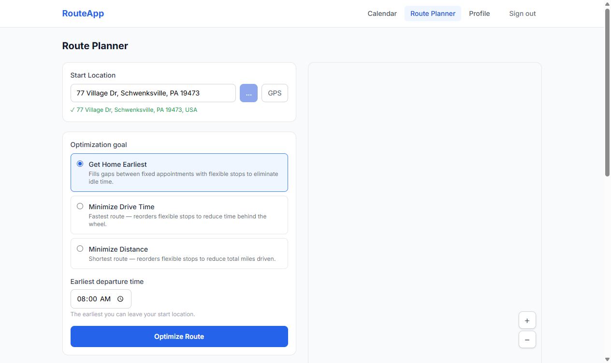

**Result: Get Home Earliest mode — route drawn, optimizer response:**

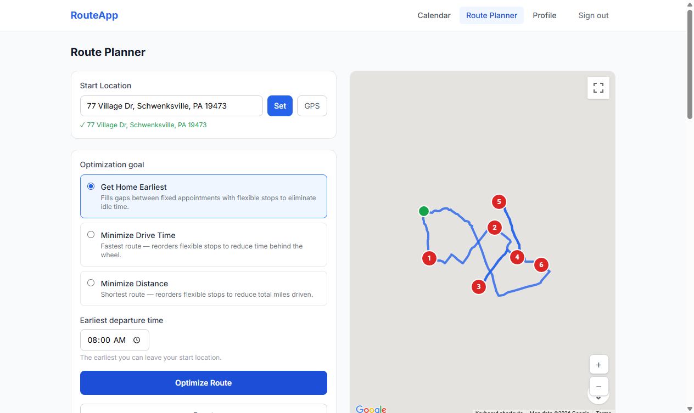

**Result: Minimize Drive Time — "Total drive time: 2h 39m · 85.0 mi":**

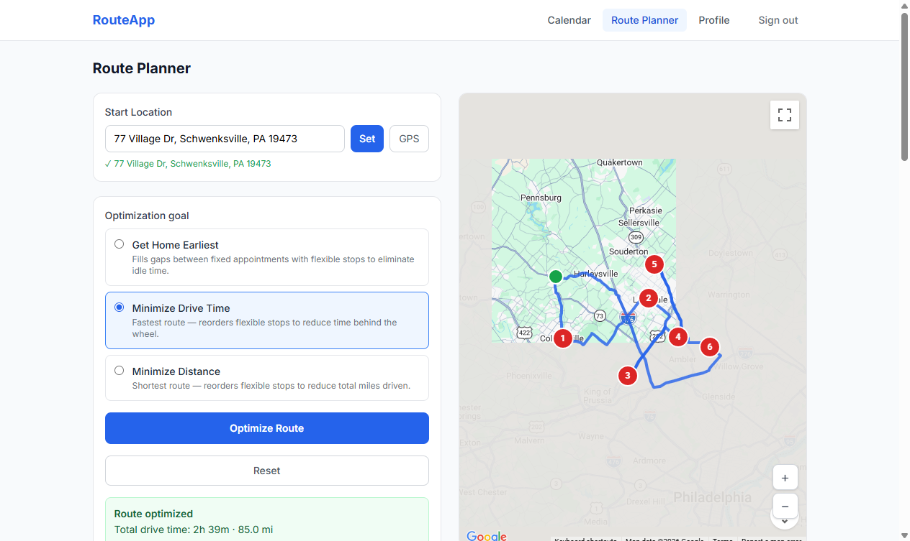

**Result: Minimize Distance:**

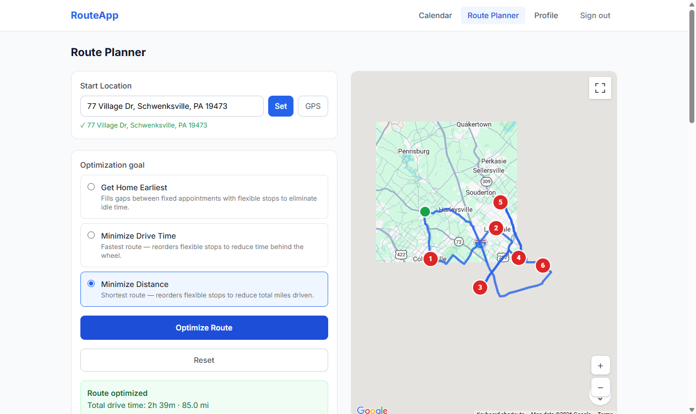

---

#### Test 2 — Profile Persistence After Sign-Out

**Profile saved with test values (Electric, Pickup Truck, 3 axles):**

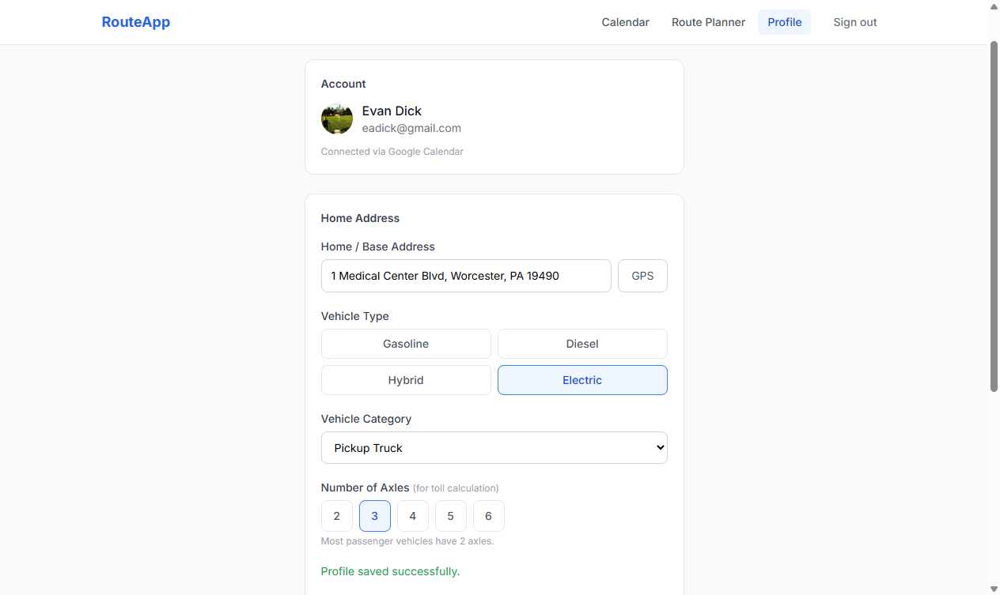

**Same values present after sign-out / sign-in cycle:**

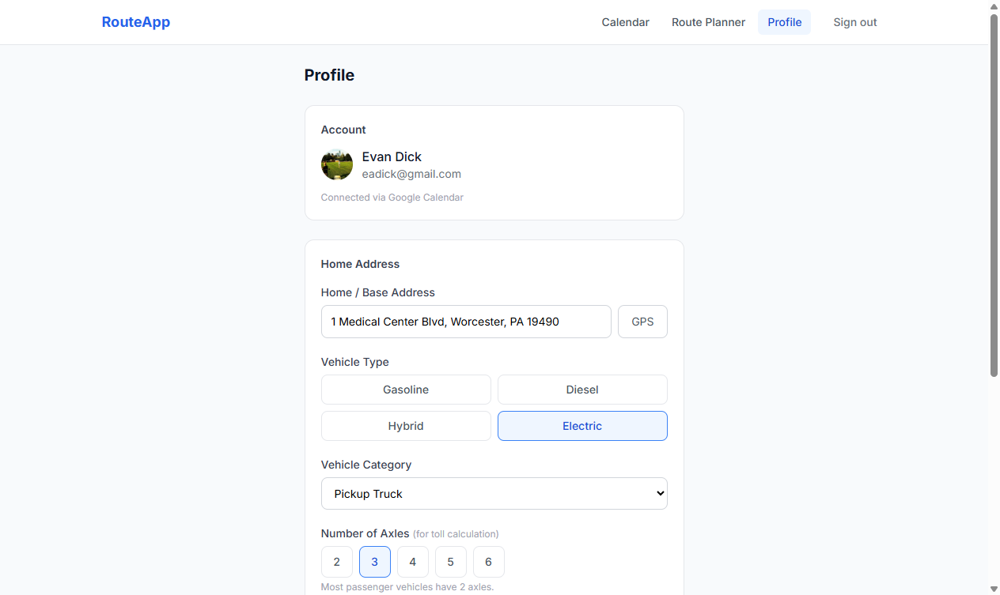

---

#### Test 3 — Stop Management

**4 calendar events selected on Saturday dashboard — "Plan Route (4)" visible in header:**

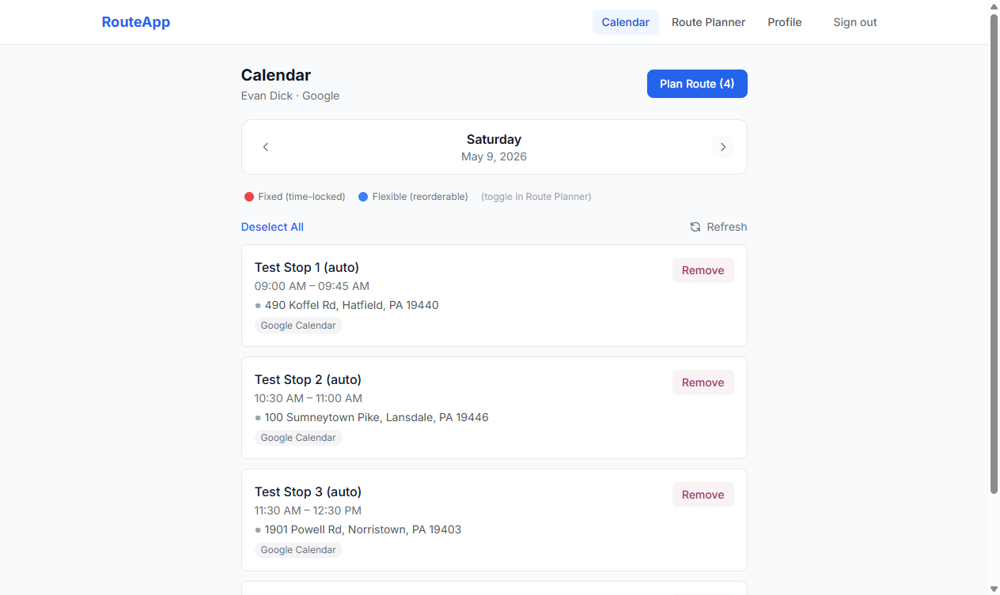

**Planner loaded with 4 stops — start location auto-populated from profile:**

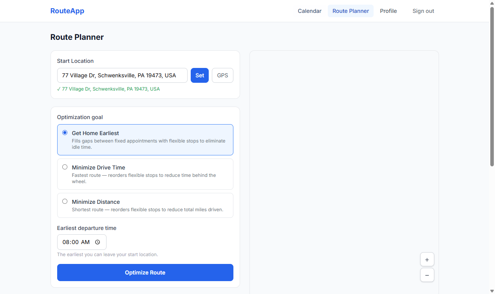

**Stop 1 toggled to Flexible — counter shows "4 stops · 3 fixed · 1 flexible":**

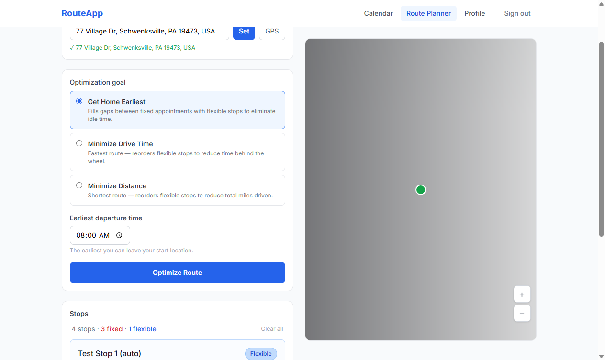

**Stop 4 removed — counter shows "3 stops · 2 fixed · 1 flexible", Stop 1 still Flexible:**

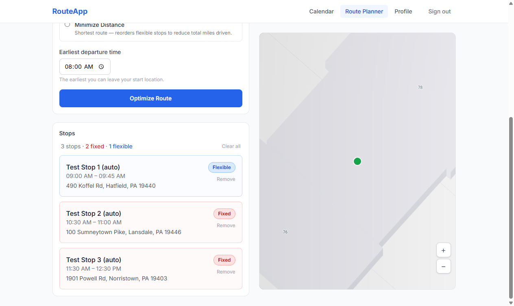

---

#### Test 4 — Fixed Appointment Time Constraint

**Planner before optimization — 3 stops, Stop B remains Fixed:**

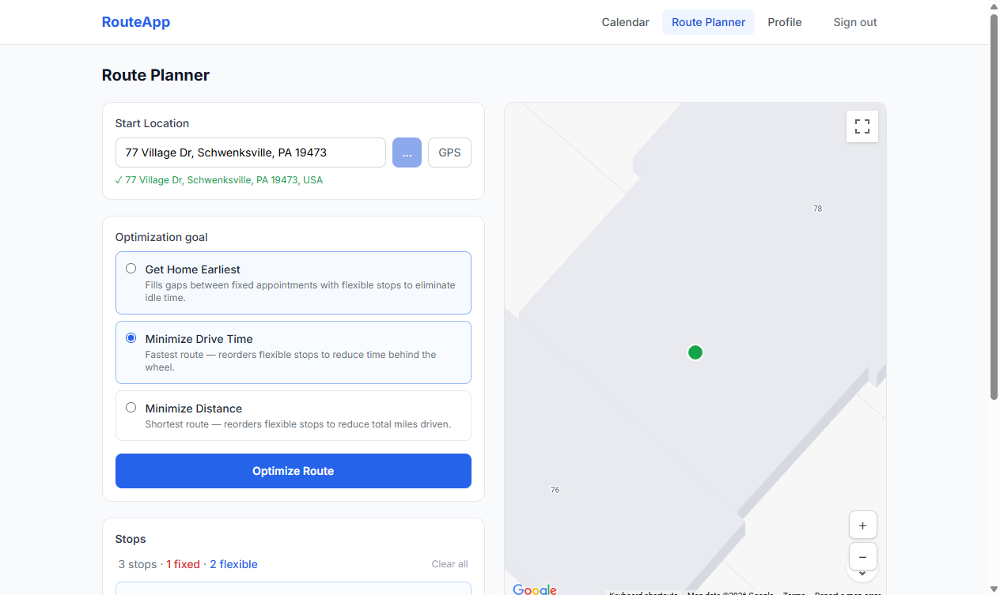

**Itinerary result — route optimized: 1h 23m · 35.7 mi, no late-arrival warning on Stop B:**

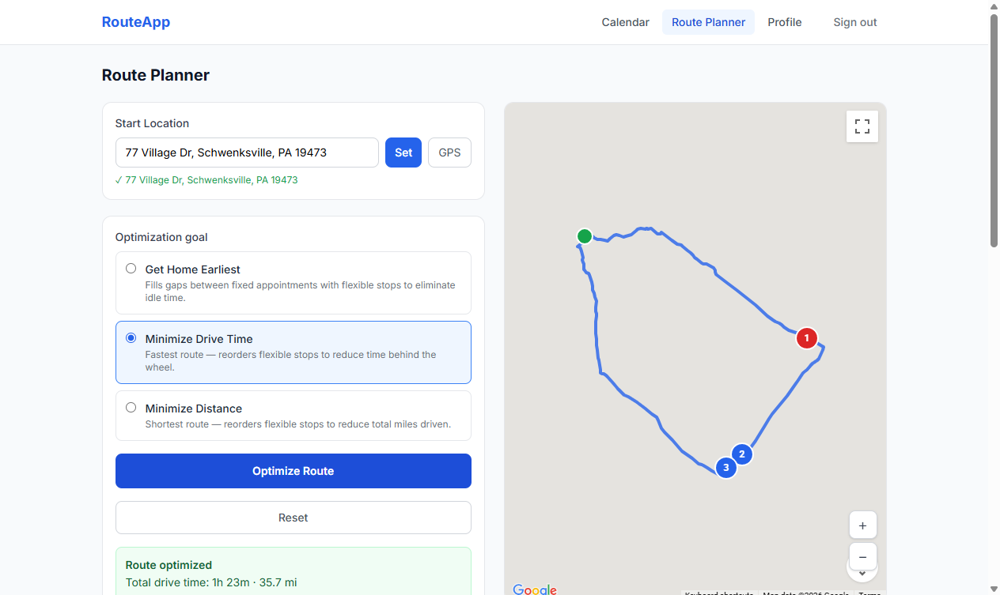

---

## Video / Demo

`TestSuiteRun5.3.26.mp4` — screen capture of `pytest -v` running all four tests against the live Vercel deployment (5 min 07 s, recorded 3 May 2026).

[▶ Watch RouteApp Selenium Test Run](https://regis365-my.sharepoint.com/:v:/g/personal/edick_regis_edu/IQBLrnPhWHdMR6mOGC8VVIGHAVo3dgIoKRJQt2HTYCh0lWg?nav=eyJyZWZlcnJhbEluZm8iOnsicmVmZXJyYWxBcHAiOiJPbmVEcml2ZUZvckJ1c2luZXNzIiwicmVmZXJyYWxBcHBQbGF0Zm9ybSI6IldlYiIsInJlZmVycmFsTW9kZSI6InZpZXciLCJyZWZlcnJhbFZpZXciOiJNeUZpbGVzTGlua0NvcHkifX0&e=4tlXK7)
